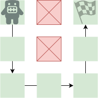

A 2D A* (A Star) algorithm for C#
=====


[](https://www.nuget.org/packages/AStarLite/)

The world is represented by a WorldGrid that is essentially a matrix of the C# short data type.
A value of 0 indicates the cell is closed / blocked. Any other number indicates the cell is open and traversable.
It is recommended to use 1 for open cells as numbers greater and less than 0 may be used to apply penalty or
priority to movement through those nodes in the future.

The WorldGrid can be indexed via Unity's Vector2Int

## Example usage


```csharp
   var pathfinderOptions = new PathFinderOptions { 
      PunishChangeDirection = true,
      UseDiagonals = false, 
   };

   var tiles = new short[,] {
      { 1, 0, 1 },
      { 1, 0, 1 },
      { 1, 1, 1 },
   };

    var worldGrid = new WorldGrid(tiles);
    var pathfinder = new PathFinder(worldGrid, pathfinderOptions);
    
    // indexing
    Vector2Int[] path = pathfinder.FindPath(new Vector2Int(0, 0), new Vector2Int(0, 2));

```

## Options
 - Allowing / restricting diagonal movement
 - A choice of heuristic (Manhattan, MaxDxDy, Euclidean, Diagonal shortcut)
 - The option to punish direction changes.
 - A search limit to short circuit the search

## FAQ

q. why doesn't this algorithm always find the shortest path?

a. A* optimises speed over accuracy. Because the algorithm relies on a 
heuristic to determine the distances from start and finish, it won't necessarily
produce the shortest path to the target.
## Changes from 1.1.0 to U1.0
- Ported to use Unity Engine's Vector2 instead of the provided Position struct or C# Point struct.
## Changes from 1.0.0 to 1.1.0
- Reimplemented the punish change direction to perform more consistently

## Changes from 0.1.x to 1.0.0
- The world is now represented by a WorldGrid that uses shorts internally instead of bytes
- If no path is found, the algorithm now reports an empty array instead of null
- Moved out of the AStar.Core namespace into simply AStar
- Replaced former Point class with the new Position class that uses Row / Column instead of X / Y to avoid confusion with cartesian co-ordinates
- Implemented support for Point class indexing and pathing which represent a traditional cartesian co-ordinate system
- Changed path from List to Array and changed type from PathFinderNode to Position or Point
- Reversed the order of the returned path to start at the start node
- Rationalised and dropped buggy options (heavy diagonals)
